<div align="center">

<!-- Cyber-themed Header -->


# A X I O M
### ⚡ SECURE DIGITAL VAULT ⚡

<sub>━━━━━━━━━━━━━━━━━━━━━━━━━━━━━━━━━━━━━━━━━━━━━━━</sub>

**`YOUR FILES` • `YOUR KEYS` • `YOUR PRIVACY`**

<sub>━━━━━━━━━━━━━━━━━━━━━━━━━━━━━━━━━━━━━━━━━━━━━━━</sub>

<br>

[](https://flutter.dev)
[](https://dart.dev)
[](#)
[](#)

<sub>🔐 ZERO-KNOWLEDGE ARCHITECTURE • CLIENT-SIDE ENCRYPTION • END-TO-END SECURITY 🔐</sub>

</div>

<br>

---

<div align="center">

## ⚡ TACTICAL OVERVIEW

</div>

```ascii
╔════════════════════════════════════════════════════════════════╗
║                                                                ║
║   AXIOM is a next-generation encrypted storage platform       ║
║   where YOU control your data destiny. True client-side       ║
║   encryption means your files are locked down BEFORE they     ║
║   leave your device. Only you possess the decryption keys.    ║
║                                                                ║
║   • AES-256-GCM MILITARY-GRADE ENCRYPTION                     ║
║   • ZERO-KNOWLEDGE SERVER ARCHITECTURE                        ║
║   • CROSS-PLATFORM NATIVE PERFORMANCE                         ║
║   • HKDF CRYPTOGRAPHIC KEY DERIVATION                         ║
║                                                                ║
╚════════════════════════════════════════════════════════════════╝
```

<br>

<div align="center">

## 🎯 CORE DIRECTIVES

</div>

<table>
<tr>
<td align="center" width="25%">
<br>

<br><br>
<b>SOVEREIGN KEY CONTROL</b>
<br>
<sub>Not servers. Not providers.<br>Just <b>YOU</b>.</sub>
<br><br>
</td>
<td align="center" width="25%">
<br>

<br><br>
<b>ON-DEVICE ENCRYPTION</b>
<br>
<sub>AES-256-GCM locks your<br>data before upload</sub>
<br><br>
</td>
<td align="center" width="25%">
<br>

<br><br>
<b>ZERO KNOWLEDGE</b>
<br>
<sub>Server breach?<br>Your data stays locked.</sub>
<br><br>
</td>
<td align="center" width="25%">
<br>

<br><br>
<b>PERFORMANCE TUNED</b>
<br>
<sub>Smart processing for<br>any file size</sub>
<br><br>
</td>
</tr>
</table>

<br>

---

<div align="center">

## 📡 INTERFACE RECONNAISSANCE

<sub>▼ SYSTEM SCREENSHOTS ▼</sub>

</div>

<br>

<div align="center">

### 🌐 ENTRY SEQUENCE

<table>
<tr>
<td width="50%" align="center">

<br>

</td>
<td width="50%" align="center">

<br>

</td>
</tr>
</table>

### 🎯 COMMAND CENTER

<table>
<tr>
<td width="50%" align="center">

<br>

</td>
<td width="50%" align="center">

<br>

</td>
</tr>
</table>

### ⚡ REAL-TIME DECRYPTION

<table>
<tr>
<td align="center">

<br>

</td>
</tr>
</table>

</div>

<br>

---

<div align="center">

## 🔒 SECURITY PROTOCOLS

</div>

<table width="100%">
<tr>
<td width="50%">

### 🛡️ ENCRYPTION LAYER

```yaml
Algorithm: AES-256-GCM
Mode: Authenticated Encryption
Key Size: 256-bit
IV: 16-byte Random (per file)
Tag: 16-byte Authentication
Processing: Client-Side Only
```

</td>
<td width="50%">

### 🔑 KEY MANAGEMENT

```yaml
Master Key: Platform Keychain
Derivation: HKDF with Salt
DEK: Device Encryption Key
Transmission: NEVER
Storage: Local Only
Access: User Exclusive
```

</td>
</tr>
</table>

<details>
<summary><h3>🔐 ADVANCED SECURITY FEATURES</h3></summary>

<br>

| PROTOCOL | DESCRIPTION | STATUS |
|----------|-------------|--------|
| **🔒 Client-Side Encryption** | All files encrypted before upload | `ACTIVE` |
| **🔑 Zero-Knowledge Design** | Server has zero access to keys | `ACTIVE` |
| **🧬 HKDF Key Derivation** | Cryptographic key generation | `ACTIVE` |
| **🗑️ Secure Memory Wipe** | Multi-pass overwrite on cleanup | `ACTIVE` |
| **📸 Screenshot Protection** | Prevents unauthorized captures | `ACTIVE` |
| **🔐 Session Security** | Auto-logout on security events | `ACTIVE` |

</details>

<br>

---

<div align="center">

## 📁 FILE OPERATIONS

</div>

<details open>
<summary><h3>⚡ INTELLIGENT PROCESSING ENGINE</h3></summary>

<br>

```
┌─────────────────────────────────────────────────────────┐
│                                                         │
│  FILE SIZE < 50MB                                      │
│  ├─> RAM-ONLY ENCRYPTION                               │
│  ├─> INSTANT PROCESSING                                │
│  └─> ZERO DISK I/O                                     │
│                                                         │
│  FILE SIZE > 50MB                                      │
│  ├─> OPTIMIZED STREAMING (5MB CHUNKS)                  │
│  ├─> UNLIMITED SIZE SUPPORT                            │
│  └─> MEMORY EFFICIENT                                  │
│                                                         │
└─────────────────────────────────────────────────────────┘
```

</details>

<details open>
<summary><h3>🎯 UNIVERSAL FILE SUPPORT</h3></summary>

<br>

<table>
<tr>
<td align="center" width="25%">
<br>

<br><br>
JPG • PNG • WebP<br>HEIC • GIF • BMP
<br><br>
</td>
<td align="center" width="25%">
<br>

<br><br>
MP4 • MKV • AVI<br>MOV • WebM • FLV
<br><br>
</td>
<td align="center" width="25%">
<br>

<br><br>
PDF • TXT • DOCX<br>XLSX • PPTX • MD
<br><br>
</td>
<td align="center" width="25%">
<br>

<br><br>
MP3 • WAV • FLAC<br>AAC • OGG • M4A
<br><br>
</td>
</tr>
</table>

</details>

<details open>
<summary><h3>🚀 PERFORMANCE SPECS</h3></summary>

<br>

| METRIC | SPECIFICATION |
|--------|---------------|
| **🔄 Background Processing** | Dart Isolates (True Parallel) |
| **📊 Progress Tracking** | Dual-Phase (DL+Decrypt / Encrypt+UL) |
| **✨ UI Framerate** | 60 FPS Guaranteed |
| **⚡ Update Throttle** | 50ms for Smooth Animation |
| **🛑 Cancellation** | Clean Shutdown + Resource Cleanup |
| **🎯 Smart Progress** | 0-60% Instant Feedback |

</details>

<br>

---

<div align="center">

## 🔐 ENCRYPTION WORKFLOW

```mermaid
%%{init: {'theme':'dark', 'themeVariables': { 'primaryColor':'#00D4FF','primaryTextColor':'#fff','primaryBorderColor':'#00D4FF','lineColor':'#9D00FF','secondaryColor':'#0A1628','tertiaryColor':'#1a2332'}}}%%
graph LR
    A[📁 User File] -->|Generate IV| B[🎲 Random IV]
    B -->|Encrypt| C[🔐 AES-256-GCM]
    C -->|Package| D[📦 IV+Cipher+Tag]
    D -->|Upload| E[☁️ Server Storage]
    
    E -->|Download| F[📥 Encrypted Blob]
    F -->|Decrypt| G[🔓 AES-256-GCM]
    G -->|Verify| H[✅ Authenticated]
    H -->|Output| I[📄 Your File]
    
    style A fill:#00D4FF,stroke:#00D4FF,color:#0A1628
    style C fill:#9D00FF,stroke:#9D00FF,color:#fff
    style E fill:#1a2332,stroke:#00D4FF,color:#00D4FF
    style G fill:#00D4FF,stroke:#00D4FF,color:#0A1628
    style I fill:#00D4FF,stroke:#00D4FF,color:#0A1628
```

</div>



<br>

---

<div align="center">

## 🛠️ TECH STACK

<sub>▼ POWERED BY CUTTING-EDGE TECHNOLOGY ▼</sub>

</div>

<br>

<div align="center">

### CORE FRAMEWORK


### CRYPTOGRAPHY


### PLATFORM INTEGRATION


### SUPPORTED PLATFORMS


</div>

<br>

---

<div align="center">

## 🗺️ DEVELOPMENT ROADMAP

</div>

<table>
<tr>
<td align="center" width="33%">

### 📱 PHASE 1
**MOBILE OPTIMIZATION**

```
✓ Touch Gestures
✓ Mobile UX
✓ Offline Mode
✓ Background Sync
```

</td>
<td align="center" width="33%">

### 🔗 PHASE 2
**COLLABORATION**

```
→ Secure Sharing
→ Time-Limited Access
→ Multi-User
→ Permissions
```

</td>
<td align="center" width="33%">

### 🌐 PHASE 3
**WEB PLATFORM**

```
→ Web Client
→ PWA Support
→ Browser Crypto
→ Universal Access
```

</td>
</tr>
<tr>
<td align="center" width="33%">

### 🔍 PHASE 4
**ADVANCED SEARCH**

```
→ Full-Text Search
→ Encrypted Index
→ Smart Filters
→ Query Builder
```

</td>
<td align="center" width="33%">

### 📊 PHASE 5
**ANALYTICS**

```
→ Usage Insights
→ Storage Trends
→ File Analytics
→ Client-Side Only
```

</td>
<td align="center" width="33%">

### 🎨 PHASE 6
**CUSTOMIZATION**

```
→ Light Mode
→ Custom Themes
→ Layout Options
→ User Preferences
```

</td>
</tr>
</table>

<br>

---

<div align="center">

## 📞 SUPPORT CHANNELS

</div>

<div align="center">

[](mailto:support@axiomvault.com)
[](https://github.com/himanshuchaurasiya24)

</div>

<br>

---

<div align="center">

## ⚖️ LEGAL & PRIVACY

</div>

### COPYRIGHT NOTICE

```
█████╗ ██╗  ██╗██╗ ██████╗ ███╗   ███╗
██╔══██╗╚██╗██╔╝██║██╔═══██╗████╗ ████║
███████║ ╚███╔╝ ██║██║   ██║██╔████╔██║
██╔══██║ ██╔██╗ ██║██║   ██║██║╚██╔╝██║
██║  ██║██╔╝ ██╗██║╚██████╔╝██║ ╚═╝ ██║
╚═╝  ╚═╝╚═╝  ╚═╝╚═╝ ╚═════╝ ╚═╝     ╚═╝

© 2026 Himanshu Chaurasiya. All Rights Reserved.
```

**PROPRIETARY SOFTWARE** - Unauthorized copying, distribution, or modification is strictly prohibited.

### PRIVACY POLICY

<table width="100%">
<tr>
<td align="center" width="25%">

<br><sub>We cannot access<br>your encrypted files</sub>
</td>
<td align="center" width="25%">

<br><sub>Zero tracking,<br>telemetry, or logging</sub>
</td>
<td align="center" width="25%">

<br><sub>We never sell or<br>share user data</sub>
</td>
<td align="center" width="25%">

<br><sub>Encryption keys<br>stored locally only</sub>
</td>
</tr>
</table>

<br>

---

<div align="center">

<sub>━━━━━━━━━━━━━━━━━━━━━━━━━━━━━━━━━━━━━━━━━━━━━━━</sub>

### 🔐 BUILT WITH PRIVACY IN MIND


**A X I O M**

*Your Secure Digital Vault*

<sub>━━━━━━━━━━━━━━━━━━━━━━━━━━━━━━━━━━━━━━━━━━━━━━━</sub>

<br>


<br>

<sub>🔒 Crafted with Security & Privacy by **[Himanshu Chaurasiya](https://github.com/himanshuchaurasiya24)** 🔒</sub>

<sub>━━━━━━━━━━━━━━━━━━━━━━━━━━━━━━━━━━━━━━━━━━━━━━━</sub>

</div>
